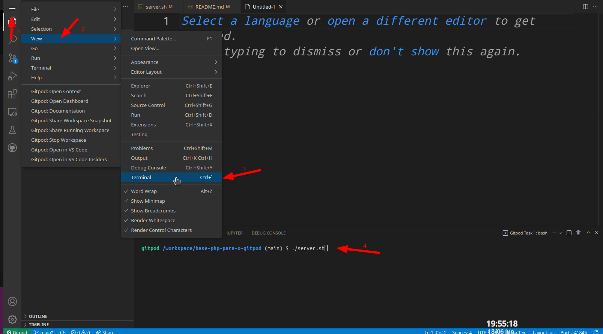
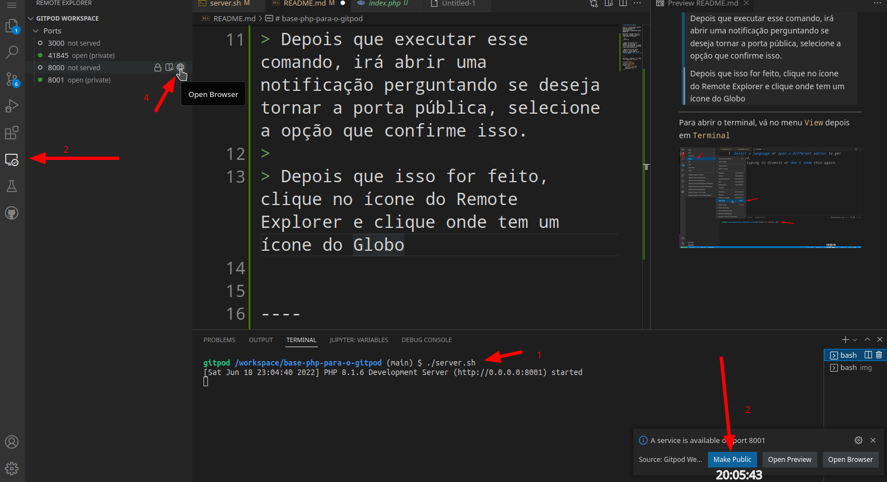

# base-php-para-o-gitpod

[Abrir no GitPod](https://gitpod.io#https://github.com/ministracao-aulas/base-php-para-o-gitpod/edit/main/README.md)

Após abrir o GitPos, para ver o projeto no navegador, execute a linha abaixo no terminal:

```sh
./server.sh
```

----

## Abrindo o terminal

Para abrir o terminal, vá no menu `View` depois em `Terminal`

<p align="center">
<a href="./_docs/img/opening_terminal.png" target="_blank">
    </a>
</p>

----

> Depois que executar esse comando, irá abrir uma notificação perguntando se deseja tornar a porta pública, selecione a opção que confirme isso.
>
> Depois que isso for feito, clique no ícone do `Remote Explorer` e clique onde tem um ícone do Globo que irá abrir automaticamente uma aba do navegador mostrando o projeto sendo servido pelo próprio PHP.


<p align="center">
<a href="./_docs/img/opening_ports.png" target="_blank">
    </a>
</p>

